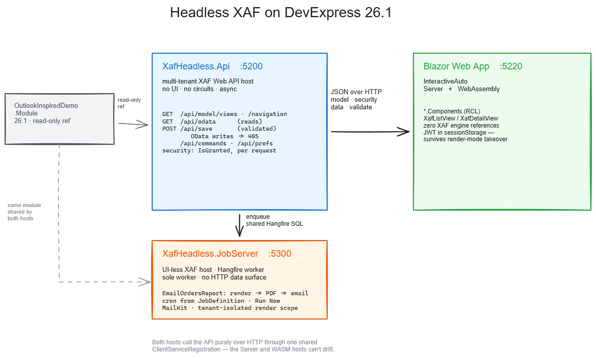

# XafHeadless — Headless XAF on DevExpress 26.1

**For XAF developers.** Host DevExpress XAF's model-driven core — **TypesInfo, the Application Model, the
Security System, Validation** — in a plain ASP.NET Core Web API, project it as JSON over HTTP, and render real
XAF views in a thin, multi-render-mode Blazor client that holds **zero** XAF engine references. No model or
security logic is re-implemented anywhere; the client renders whatever the server projects.

Everything here runs on **DevExpress 26.1.3 / .NET 10**, grounded on DevExpress's own **OutlookInspired** demo
module — so with 26.1 and its demos installed, you can clone, build, and run this standalone, no customer
database required.

```
┌─────────────────────────┐        JSON over HTTP        ┌──────────────────────────────┐
│  XafHeadless.Api (:5200) │  ◄───────────────────────►  │  Blazor Web App client (:5220)│
│  multi-tenant XAF host   │   model · security · data   │  InteractiveAuto (Server+WASM)│
│  (no UI, no circuits)    │   validate · commands       │  zero XAF engine references    │
└────────────┬────────────┘                              └──────────────────────────────┘
     enqueue │ (shared Hangfire SQL)                          XafListView / XafDetailView
             ▼
┌───────────────────────────────┐   background jobs · report → PDF · email
│ XafHeadless.JobServer (:5300)  │   Hangfire worker · cron · Run Now (SVR-001)
│ UI-less XAF host · sole worker  │   (no HTTP data surface)
└───────────────────────────────┘
        OutlookInspired.Module (read-only ref, shared by both hosts)
```

## Why

XAF's Blazor **UI** stack carries a heavy adapter tax — component-model mirror layers, render gating,
sync-over-async, one `XafApplication` per circuit. But XAF's crown jewels are UI-framework-free. Put them
behind a Web API, project the model as data, and any HTTP client (Blazor WASM/Server, MAUI, React) renders
real XAF views: **async end-to-end, every render mode, no circuit-held application state.** An existing XAF
Blazor Server app keeps running off the same module — you adopt this **view by view (a strangler fig), not as
a rewrite.**

## Quickstart

**Prerequisites:** DevExpress 26.1 + its demos installed; .NET 10 SDK; SQL Server LocalDB.

> **DevExpress demo module (where the model comes from, and how to point at it).** This repo is
> *grounded on* DevExpress's own **OutlookInspiredDemo** module — its business model
> (Order/Employee/Customer/Product, their views, security, and reports) is what the platform projects
> and renders. That module is **not** vendored here: `XafHeadless.Api` and `XafHeadless.JobServer`
> `ProjectReference` it from your local DevExpress demos install. The reference resolves through a single
> MSBuild property in [`Directory.Build.props`](Directory.Build.props) — `DevExpressDemosDir`, defaulting
> to the standard Windows location `C:\Users\Public\Documents\DevExpress Demos 26.1`. If your demos are
> elsewhere, override it **without editing any project file**:
> ```
> dotnet build XafHeadless.slnx -p:DevExpressDemosDir="D:\path\to\DevExpress Demos 26.1"
> ```
> (or set a `DevExpressDemosDir` environment variable). You need a licensed **DevExpress 26.1
> subscription** with the demos installed; the `DevExpress.*` NuGet packages restore from your own
> licensed feed. Nothing DevExpress-licensed is redistributed in this repo.

**One-time setup**

1. Create `XafHeadless.Api/appsettings.Development.json` (gitignored) with a real JWT signing key — the
   committed `appsettings.json` ships an **empty** key on purpose, and login 500s without it:
   ```json
   { "Authentication": { "Jwt": { "IssuerSigningKey": "<any random string of 32+ characters>" } } }
   ```
   If you also run the JobServer, give it **`XafHeadless.JobServer/appsettings.Development.json` with the
   SAME key** — it ships the same empty key, and it *validates* the JWTs the Api mints rather than issuing
   its own, so a different key rejects every token. With no key at all the JWT middleware throws
   `IDX10703: … key length is zero` on **every** request, including the anonymous `/health` endpoint, so
   the host looks booted but answers 500 to everything.
2. Tenant data: logging in as `Admin@company1.com` resolves to the demo's tenant catalog
   (`OutlookInspiredDemo_company1`). Either run the DevExpress demo's own `Blazor.Server` app once to seed it,
   **or** the host self-seeds it via `.WithTenantDatabaseUpdater()` (already enabled — see
   [`docs/HOW-TO-IMPLEMENT.md`](docs/HOW-TO-IMPLEMENT.md) and the reseed recipe in
   [`docs/notes/test-fixtures.md`](docs/notes/test-fixtures.md)). The host owns a disposable `XafHeadlessDemo`
   catalog it creates itself.

**Run**

```
dotnet restore XafHeadless.slnx && dotnet build XafHeadless.slnx

dotnet run --project XafHeadless.Api    # API host           → http://localhost:5200
dotnet run --project XafHeadless.Web    # Blazor Web App      → http://localhost:5220
```

Open `http://localhost:5220`, log in as `Admin@company1.com` with a **blank password** (public demo
credentials). The menu, lists, detail views, filtering, and saves are all driven by projected metadata.

**Tests**

```
dotnet test XafHeadless.Components.Tests   # client unit tests, no host required
dotnet test XafHeadless.Api.Tests          # API integration tests (needs the API host on :5200)
dotnet test XafHeadless.E2E                # dual render-mode Playwright E2E (needs both hosts published & running)
dotnet test XafHeadless.JobServer.Tests --no-build   # needs Api + JobServer hosts + smtp4dev
```

`--no-build` on the last one is not optional while the JobServer is running: the test project references
it, so a rebuild tries to overwrite the exe the live host has locked and the run fails before a single
test executes (`MSB3027: … locked by "XafHeadless.JobServer"`). Build first, then start the hosts.



*(editable source: [`docs/architecture.excalidraw`](docs/architecture.excalidraw))*

## What it does today

The platform is well past a proof of concept — the CRUD surface, navigation, filtering, and auth are all
working end-to-end, each verified by tests. Everything below is driven by projected metadata with **no
per-view client code**.

| Capability | How |
|---|---|
| **Metadata projection** | `GET api/model/views/{id}` projects ListView/DetailView metadata — columns, deep layout trees, lookups, nested collections — **security-trimmed per role** (a denied member is *absent*, not flagged; trimming cascades through unreadable lookup targets). |
| **View-agnostic rendering** | One generic client renders any projected view. Proven across 4 distinct view pairs (Order, Employee, Customer, Product) with **zero per-view client code** — the compression claim, as an executable test. |
| **Read** | Grid data over OData (`api/odata/{type}`), with master-detail filters and nested collection tabs. **Hybrid grid binding**: views at or under 5,000 rows load in-memory (client-side grouping/sorting/filtering/column chooser); larger views (Order = 55k) bind **server-mode** — true paging, server-side grouping via OData `$apply` with a bounded bucket fetch (`$top` after `$apply`; >500 groups fails loud instead of rendering thousands of headers). |
| **Update & Create** | A validating save path (`POST api/save/{type}[/{key}]`): partial-member writes incl. **lookup/enum/reference** members; `201` + server-generated key on create; **422** with per-member errors on a rule violation (XAF's own `IValidator`); malformed key → 400; per-member `CanWrite` → 403. Raw OData writes are middleware-blocked (405). |
| **Filter UI** | The DxGrid filter row → an OData `$filter` translator. **Date columns get a metadata-driven date editor** committing a `[day, next-day)` range (typed from `ViewMetadata`, never from DxGrid's value sniffing — the sniffed-text path emitted string criteria the server rejects); `DateOnly` members classify separately (`Edm.Date` needs different literals) and sit behind an honest disabled cell in server mode, like enum/lookup captions (the documented ceiling). |
| **Navigation** | A model-projected, security-trimmed menu (`GET api/model/navigation`); post-login lands on the model's first nav item. |
| **Auth** | JWT persists across a hard reload and the InteractiveAuto **Server↔WebAssembly render-mode takeover** (sessionStorage), proven by a dual-phase E2E. |
| **Per-user layout prefs** | `GET/PUT api/prefs/{viewId}` stores per-user DxGrid column state (order/width), keyed strictly to the authenticated identity. |
| **Commands** | Server-side XAF logic crosses the wire as commands. |
| **Background jobs** | A separate UI-less **Hangfire** worker host (`XafHeadless.JobServer`, `:5300`) runs work off the request path so long/heavy jobs never block a request or die with the API. `JobDefinition`-driven **cron**, an admin-gated write path for the shared job config, a **"Run Now"** button, and one end-to-end job — `EmailOrdersReport` renders the demo's Orders report to a PDF in a **tenant-isolated child scope** and emails it (MailKit), enqueued from the Api via `POST api/commands/EmailOrdersReport` into shared Hangfire SQL. `JobDefinition`/`JobExecutionRecord` get full CRUD through the same generic client (one server-side OData convention makes host-shared BOs read correctly — see finding 6). |

Its central design property: **nothing in the projection or rendering path is view-specific.** Expose a
business type and its views render — no client change.

| Capability | How |
|---|---|
| **Self-describing failures** | A failed API call names itself: `ApiClient` throws with method, full URL **including the query string**, status and the server's own error body (for OData that body holds the reason). Paths that degrade by design still log a warning instead of vanishing. The Api logs every 4xx/5xx it answers with path + query + user. The grid's `ExceptionHandler` and an `ErrorBoundary` keep a failure from terminating the Blazor circuit; on-screen detail is Development-only. Design: [`docs/superpowers/specs/2026-08-08-runtime-diagnostics-design.md`](docs/superpowers/specs/2026-08-08-runtime-diagnostics-design.md). It found three of the bugs in findings 7–9 within minutes of existing. |
| **Styling** | The client carries the **Modernist** design system (flat, all-Archivo, red-on-light-grey, zero radius, 2px rules) as one drop-in stylesheet over the DevExpress Classic theme — `XafHeadless.Web/wwwroot/modernist-theme.css`, sourced from the handoff in `XAF Form Styling POC/`. Classic themes expose no public CSS variable API, so the DevExpress half works by redefining the theme's own `--dxbl-*` variables at matching specificity; that surface is documented as internal, and the file says so. |

### Background jobs & report rendering — `XafHeadless.JobServer` (SVR-001)

A separate **UI-less XAF host** (`:5300`) runs background work off the API request path via **Hangfire** — so
long/heavy jobs never block a request and survive an API restart. Host-owned job entities (`JobDefinition` /
`JobExecutionRecord`, OData-exposed through the Api; `ReportArtifact` / `EmailArchive` kept internal), an
admin-gated write path for the shared job config, `JobDefinition`-driven cron (`ScheduleSyncService`
reconciles rows → Hangfire recurring jobs), a client **"Run Now"** button, and one end-to-end job:
`EmailOrdersReport` renders the demo's Orders report to a PDF `ReportArtifact` in a **tenant-isolated child
scope** and **emails it** (MailKit), enqueued from the Api via `POST api/commands/EmailOrdersReport` into
shared Hangfire SQL storage (the Api is client-only; the JobServer is the sole worker). Landing this exposed
— and fixed — a real DevExpress OData framework defect on host-shared BOs (finding 6 below). Completion
record: [`docs/DONE.md`](docs/DONE.md) (SVR-001).

## For daily / production use

This is a working seed, not a toy — but it's a *seed*. If you're weighing it for real use:

- **Solid:** security trimming, the validating save contract, the guarded OData write surface, multi-tenancy,
  and render-mode freedom are all enforced and tested, not aspirational.
- **Plan for:** host-owned entities need EF Core **migrations** in a non-disposable deployment (the dev host
  catalog is created/recreated wholesale); lookup **editors** are display-only today (reference *writes* work
  at the API); app-level `Model.xafml` customizations are out of scope by decision — **module-level model is
  the contract** (put customizations in a module). See [`TODO.md`](TODO.md) for the current, honest backlog.

## Findings every XAF dev should know (even if you never go headless)

1. **XAF validation does not run on Web API OData writes.** `PersistenceValidationController` is a
   ViewController — dormant in a UI-less host. A PATCH violating `RuleRequiredField` returns 204 and silently
   persists. Use a validating save endpoint (invoke `IValidator` yourself) and/or block the raw write surface.
   Details: [`docs/notes/save-contract.md`](docs/notes/save-contract.md).
2. **XAF JWTs carry no role claims** — `[Authorize(Roles=…)]` never matches; gate admin-only endpoints with an
   in-action `ISecurityStrategyBase.User` check.
3. **The XAF model and the OData EDM diverge** — model columns can name members absent from the wire (a
   `$select` on one 400s), and the EDM's entity sets include transitive lookup targets that aren't independently
   queryable.
4. **Shared/host business objects are read-only from a tenant-resolved request** — write them from a fresh,
   tenant-null host-context scope.
5. **Auto-generated DetailView layouts are deep** (14–20 nesting levels) — raise the JSON serializer `MaxDepth`.
6. **OData constant-parameterization mis-reads `.WithSharedBusinessObjects()` types on a multi-tenant host** —
   `$filter`/`$top` literals resolve to `default(T)` against the standalone shared-BO `DbContext` (string→null,
   Guid→empty, `$top`→`Take(0)`), so a host-shared entity set returns wrong/empty data while per-tenant types
   read fine. Fix: `EnableConstantParameterization=false` via an MVC `IApplicationModelConvention`. A
   framework-level defect (SVR-003) — draft support ticket in
   [`docs/notes/devexpress-ticket-odata-shared-bo.md`](docs/notes/devexpress-ticket-odata-shared-bo.md).
7. **A `DateTime` member cannot be range-compared over OData on this host at all.** The EDM types it
   `Edm.DateTimeOffset` while the CLR property is `DateTime?`, so the query binder finds no operator for the
   pair: `$filter=OrderDate ge 2026-04-04T00:00:00Z` → **400** *"The binary operator GreaterThanOrEqual is not
   defined for the types 'Nullable&lt;DateTime&gt;' and 'Nullable&lt;DateTimeOffset&gt;'"*. Dropping the offset
   does not help — a no-offset literal fails to *parse* as `Edm.DateTimeOffset`. `date(path) op yyyy-MM-dd`
   works, needs no timezone conversion, and is what the client emits; the cost is that `date()` is not
   SARGable, so a very large table wants the EDM/CLR mismatch fixed instead ([`TODO.md`](TODO.md) GRID-006).
8. **A ListView column can name a dotted MODEL path** (`Customer.Name`) that arrives **unclassified** — a plain
   string column, `Lookup == null`. Nothing downstream may pass that dot through: OData paths need `/`
   (`$orderby=Customer.Name` → 400 *"child type … was not an entity type"*), the nav property needs `$expand`
   or the wire never carries it, and the cell must read the nested object — `row["Customer.Name"]` is a key no
   OData payload has, so the column renders permanently blank while looking merely empty.
9. **Persisted grid layout turns any rejected shaping into a permanent outage.** DxGrid's `LayoutAutoSaving`
   saves the sort/grouping that just failed, so the next load replays it and the view renders nothing —
   recoverable only by clearing the stored prefs. Two ceilings reach it that no client-side check can predict:
   sorting a lookup whose display member is `Edm.Binary` (*"the `$orderby` expression must evaluate to a single
   value of primitive type"*), and grouping a high-cardinality column (a deliberate >500-bucket guard). Strip
   the shaping when a failure is attributable to the layout. Separately, `GridPersistentLayout.PageSize` is
   `int?` with `JsonIgnore(WhenWritingDefault)`, so a null is dropped from the blob and applying that layout
   silently resets the grid to DevExpress's default of **10** rows, overriding your markup.

The full gotcha index (with fixes) is in [`docs/HOW-TO-IMPLEMENT.md`](docs/HOW-TO-IMPLEMENT.md).

## Build this yourself, from a clean start

**[`docs/HOW-TO-IMPLEMENT.md`](docs/HOW-TO-IMPLEMENT.md)** is the step-by-step guide to standing up your own
headless XAF platform on 26.1 from scratch — the standalone multi-tenant host, the metadata projection (with
its binding-contract rules), the validating save path, commands, the thin dual-render-mode client, and how to
prove it honestly — plus every gotcha that costs real debugging time.

## Repo map

```
README.md                       ← you are here
TODO.md                         ← current backlog (what's built lives in docs/DONE.md)
XafHeadless.Api/                ← 26.1 multi-tenant Web API host (OutlookInspired demo module, read-only ref)
XafHeadless.Api.Tests/          ← API integration tests
XafHeadless.JobServer/          ← UI-less Hangfire worker host: background jobs, report→PDF, email (SVR-001)
XafHeadless.JobServer.Tests/    ← JobServer integration tests (boot/RunNow/schedule/render/email + M-4 guard)
XafHeadless.Components/         ← RCL: XafListView/XafDetailView, editors, services — the client logic
XafHeadless.Components.Tests/   ← client unit tests
XafHeadless.Web/                ← Blazor Web App server host (InteractiveAuto), :5220
XafHeadless.Web.Client/         ← Blazor Web App WASM host (InteractiveAuto)
XafHeadless.E2E/                ← C# Playwright/MSTest, dual render-mode proof
docs/
  architecture.png/.excalidraw  ← the 26.1 architecture diagram
  HOW-TO-IMPLEMENT.md           ← clean-start build guide + gotcha index
  DONE.md                       ← completion record for every delivered feature
  notes/save-contract.md        ← the validation finding, in depth
  notes/test-fixtures.md        ← test-role provenance + reseed recipe
  notes/devexpress-ticket-odata-shared-bo.md  ← draft support ticket for the SVR-003 OData defect
  evidence/                     ← screenshots
```

<sub>History: this platform began as a headless-XAF feasibility POC on a production 25.2 module; that
kill-gate passed. The living code is 26.1, and this
README describes only that.</sub>
